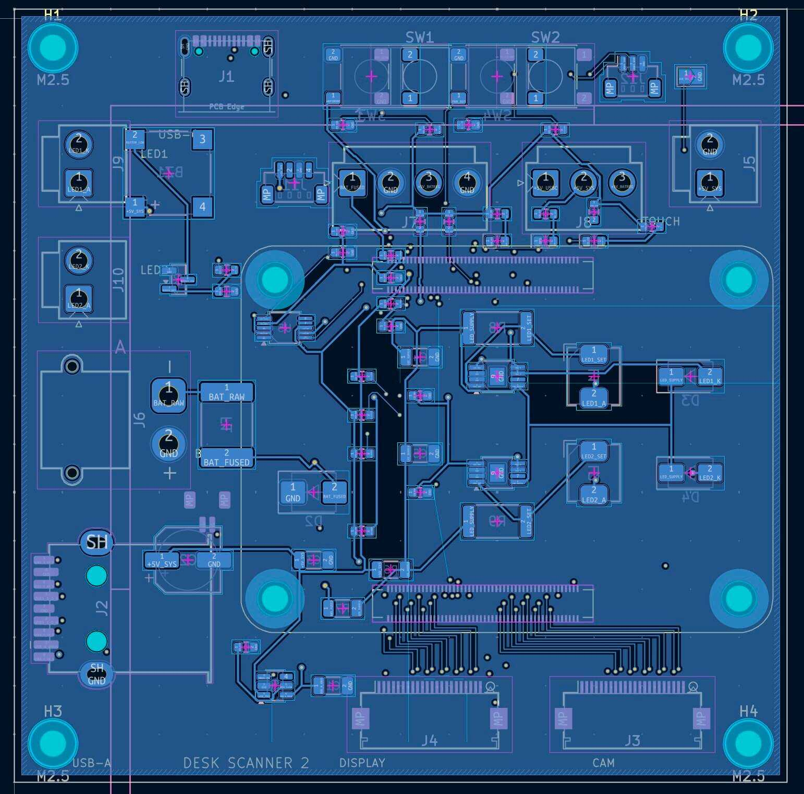
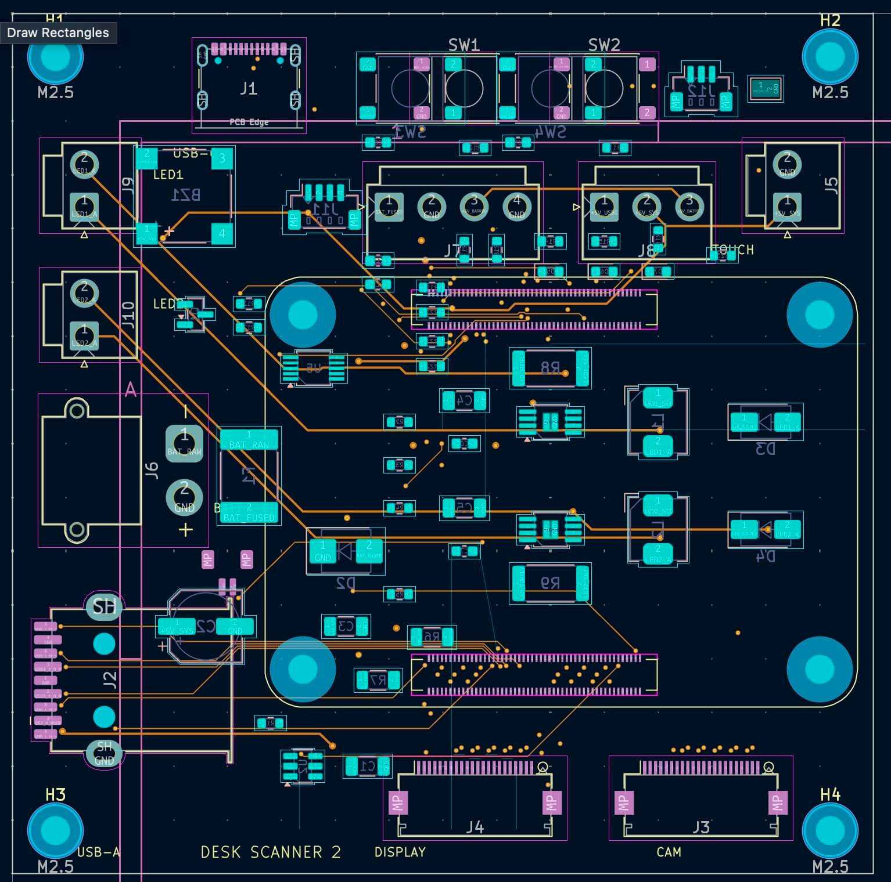
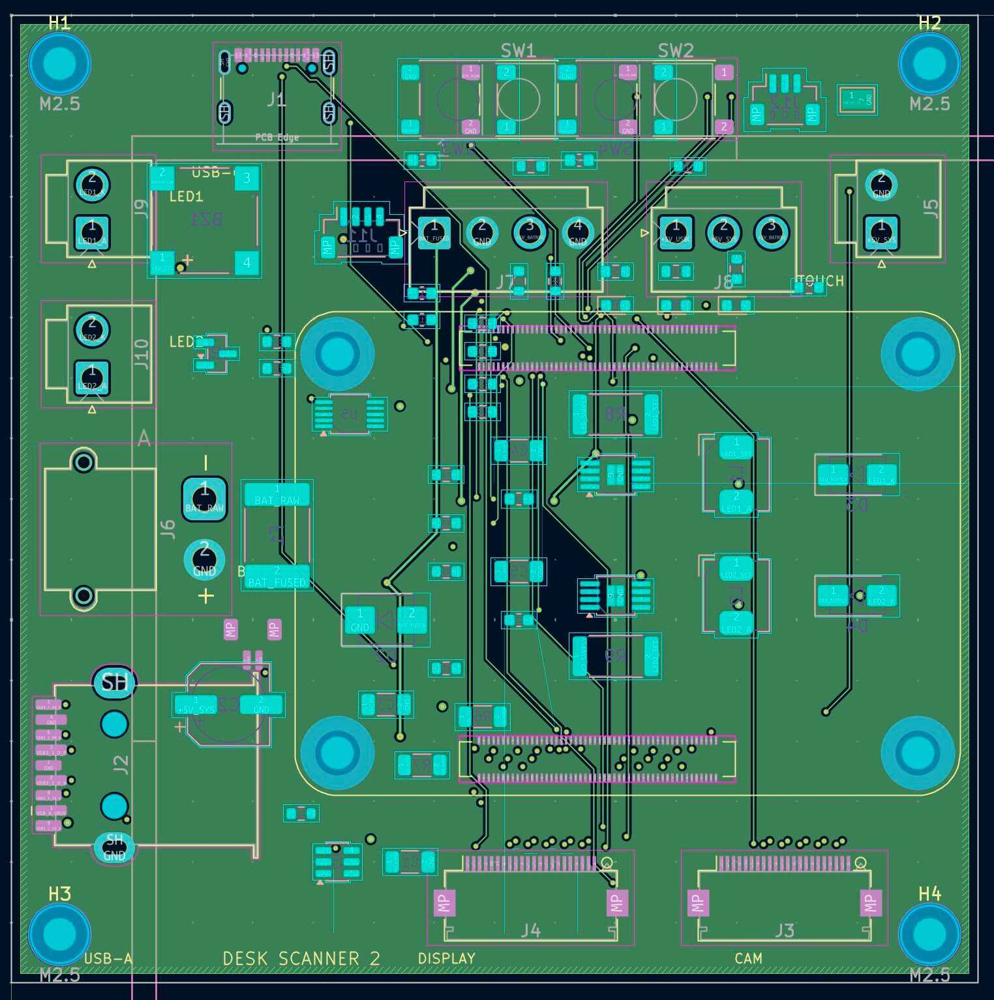
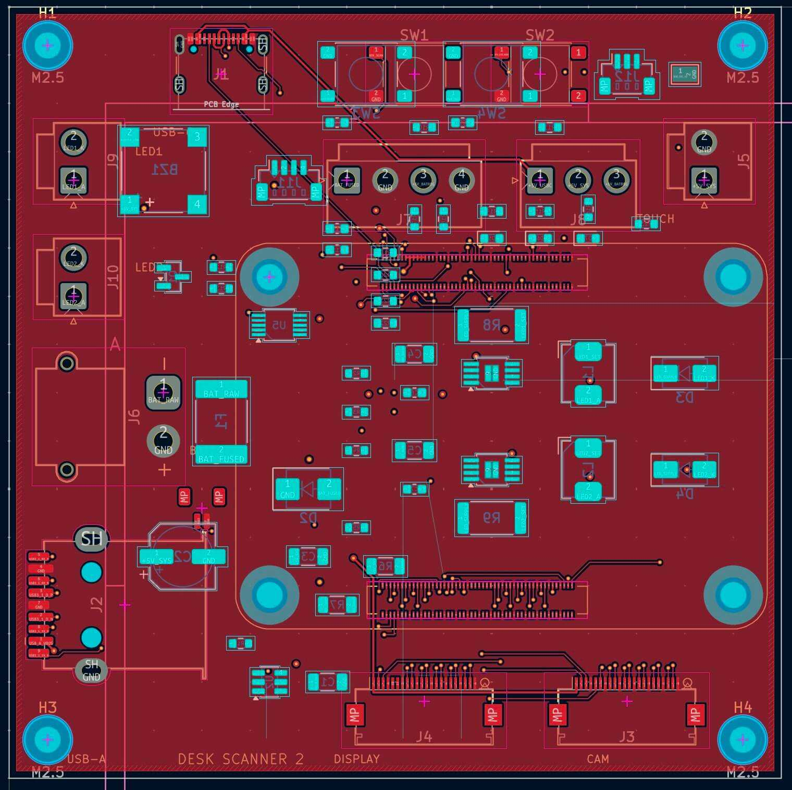

# Relearn

### The AI-Powered Education OS

Relearn is an AI-powered platform that brings students, teachers, and parents into one connected learning ecosystem.

Instead of juggling multiple apps for studying, assignments, communication, and progress tracking, Relearn combines everything into a single intelligent platform.

## Why Relearn?

Education is fragmented.

Students struggle to stay organized, teachers spend hours on repetitive tasks, and parents often lack visibility into academic progress.

Relearn uses AI to simplify learning, automate workflows, and provide personalized insights for everyone involved.

## Key Features

### For Students

* Personalized learning roadmaps
* AI study assistant
* Smart summaries, flashcards, and quizzes
* Progress tracking and goal setting

### For Teachers

* Question paper and answer sheet analysis
* Performance insights and learning-gap detection
* Automated feedback generation
* Classroom management tools

### For Parents

* Real-time academic visibility
* Progress monitoring
* Personalized learning recommendations

## ReLens

### ReLens Lite

A student-focused scanner that converts notes and worksheets into:

* Summaries
* Flashcards
* Quizzes
* Revision resources

### ReLens Edu

A teacher-focused scanner that analyzes:

* Question papers
* Answer sheets
* Student performance
* Common mistakes and learning gaps

## Tech Stack

* React
* TypeScript
* Vite
* Google Gemini
* OCR & Multimodal AI
* Custom PCB Scanner Hardware

## Vision

To build the operating system for education.

## An insider Look Into the Project

